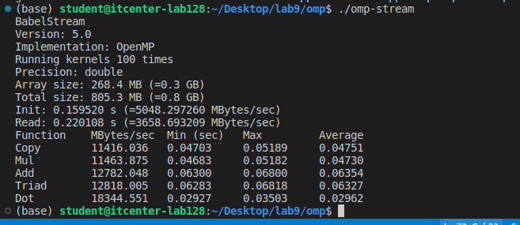
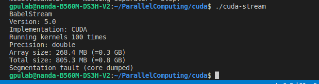

# ParallelComputing

--Description

This program is running BabelStream, a benchmark used to test the memory performance of a computer. It measures how fast the system can move and process large amounts of data using OpenMP parallel programming.

The program runs several operations (Copy, Mul, Add, Triad, Dot) 100 times and then reports how much data can be processed per second.

Array size: Around 268 MB per array

Total used memory: About 805 MB

Init / Read: Time needed to prepare and read the data

The table at the end shows the speed for each operation in MB/s.

gpulab@nanda-B560M-DS3H-V2:~/ParallelComputing/cuda$ ./cuda-stream
BabelStream
Version: 5.0
Implementation: CUDA
Running kernels 100 times
Precision: double
Array size: 268.4 MB (=0.3 GB)
Total size: 805.3 MB (=0.8 GB)
Segmentation fault (core dumped)
gpulab@nanda-B560M-DS3H-V2:~/ParallelComputing/cuda$ 

The program crashed with a Segmentation fault (core dumped).

A segmentation fault means that the program tried to access memory it wasn’t allowed to.

The arrays are too large for the available GPU memory.