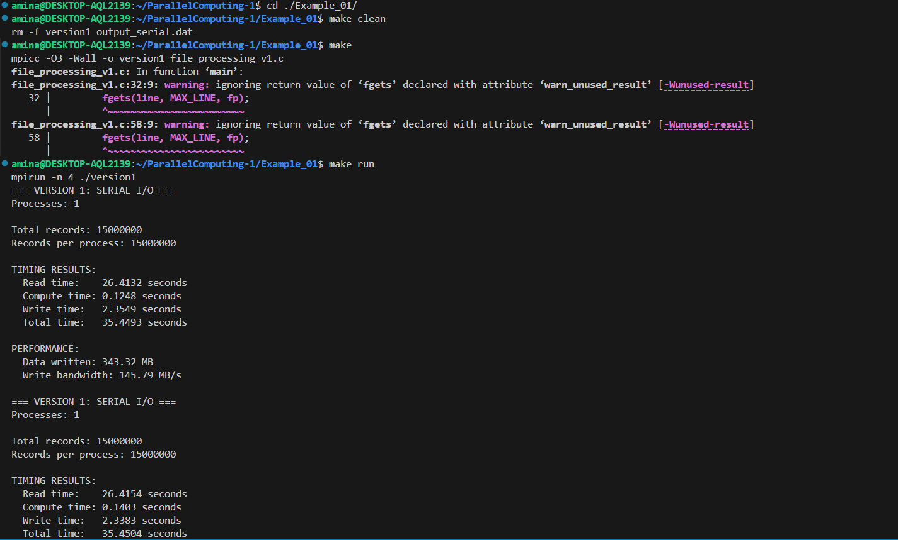
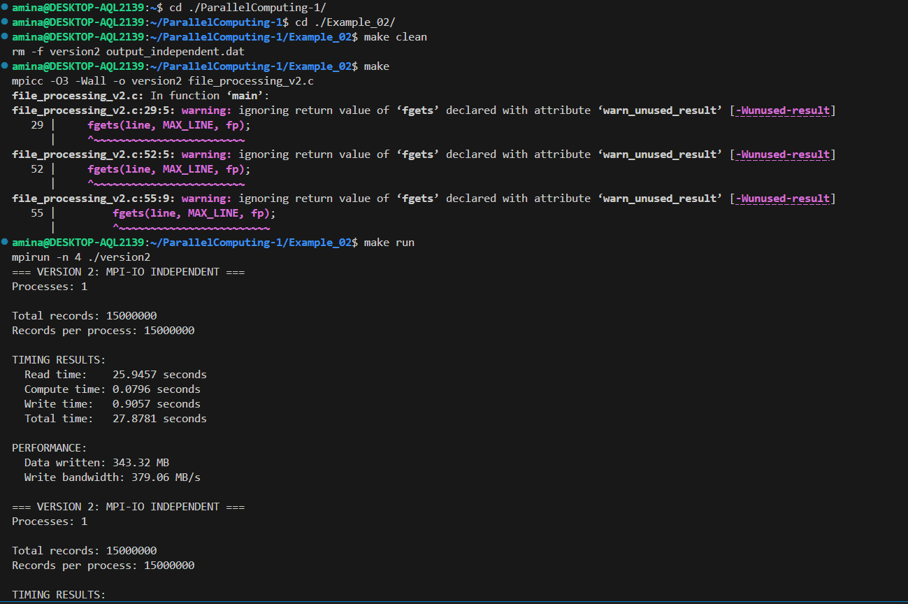
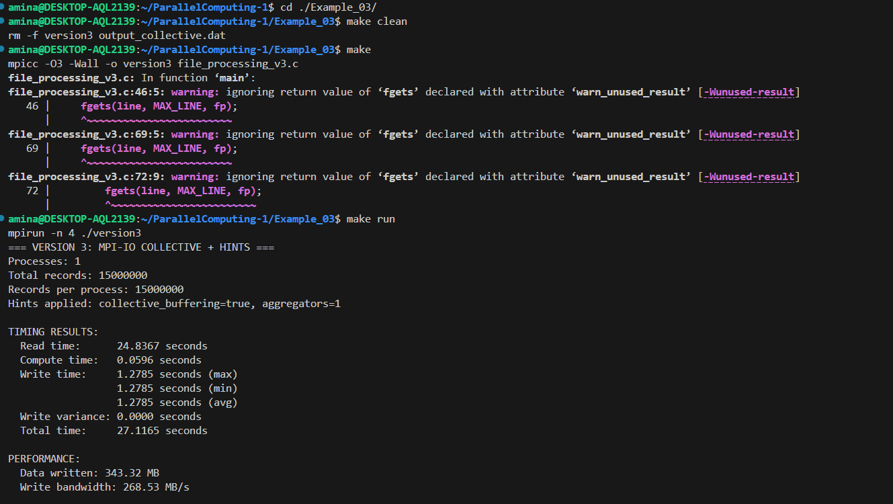
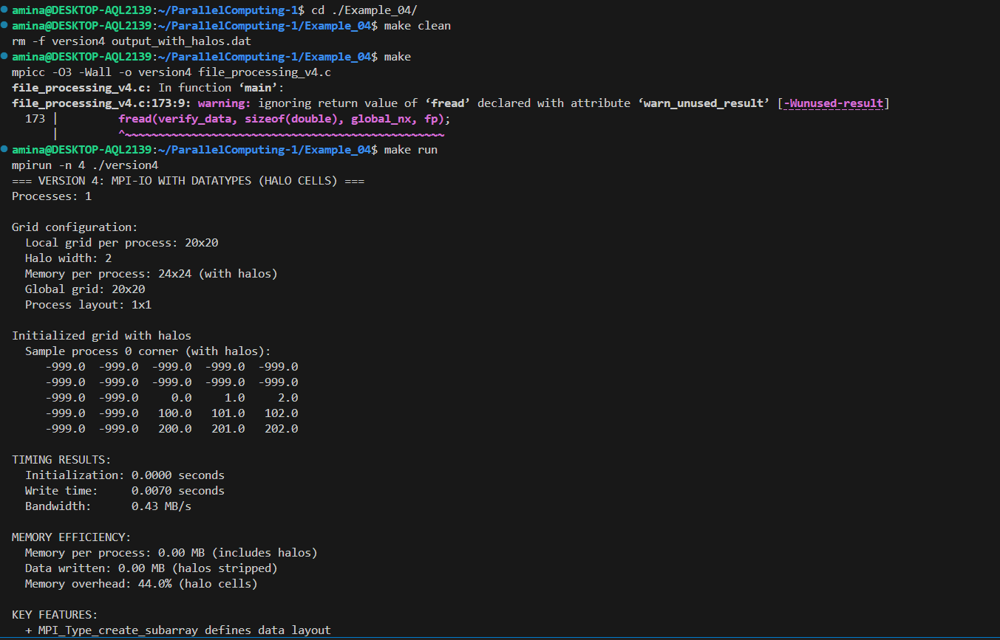

# ParallelComputing
Generated .csv file 

Main differences between executions

The main difference between the executions is how file I/O is handled.
In Example_01, all file operations are done by a single process (rank 0), while the other processes stay idle during reading and writing.
In Example_02, each process reads its own part of the file and writes independently using MPI-IO.
In Example_03, all processes participate in collective MPI-IO operations, which coordinate writes and optimize access to the filesystem using hints.

--------------------------------------------------------------------------------------------------------------------------------------------------------

Difference in execution times

The execution times differ mainly due to the way input and output are performed.
Example_01 has the longest total time because file reading and writing are fully serial.
Example_02 significantly reduces the total time by parallelizing the write phase.
Example_03 achieves the best overall behavior, with more stable and balanced write times across processes.

--------------------------------------------------------------------------------------------------------------------------------------------------------

Why there is a drastic difference between Example_01 and Example_02 / Example_03

The drastic difference occurs because Example_01 relies on serial I/O, where one process handles all data and file operations.
This creates a memory and performance bottleneck and forces all communication through rank 0.
In contrast, Example_02 and Example_03 eliminate this bottleneck by allowing each process to handle its own data and write directly to the output file in parallel.

--------------------------------------------------------------------------------------------------------------------------------------------------------

Improvements introduced in Example_03 

Example_03 introduces collective MPI-IO operations combined with filesystem hints.
These hints enable collective buffering and the use of aggregators, which group multiple write requests into larger, more efficient operations.
As a result, write operations are better synchronized, more balanced across processes, and achieve higher and more stable bandwidth compared to independent writes.

--------------------------------------------------------------------------------------------------------------------------------------------------------

Comparison of Example_02 and Example_03

In some cases, Example_02 can perform slightly better than Example_03, especially on a local machine.
This happens because collective I/O introduces synchronization overhead, and local filesystems do not fully benefit from MPI-IO optimizations.
However, Example_03 is more suitable for large-scale HPC systems with parallel filesystems, where collective buffering and aggregators significantly improve scalability and overall I/O performance.

--------------------------------------------------------------------------------------------------------------------------------------------------------

Although optional, Example_04 was also implemented to explore MPI derived datatypes and halo cells.
It demonstrates how MPI-IO can write only valid interior data to a file while automatically excluding halo regions, which is a common pattern in scientific simulations.

Example1 (terminal output)

.png)

Example2 (terminal output)

.png)

Example3 (terminal output)

.png)
.png)

Example4 (terminal output)

.png)
.png)
.png)
.png)

